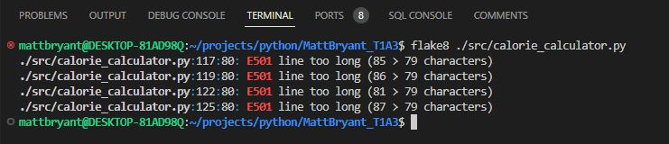
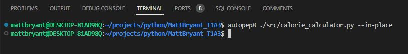
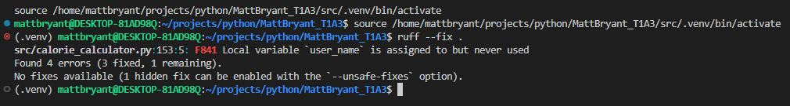

# Matt Bryant T1A3  
[Source File Repo](https://github.com/Matt-bryant21/MattBryant_T1A3)

[Linear Project Management](https://linear.app/matt-bryant-projects/project/t1a3-bbd4018b93c7)

## Referenced Materials
https://peps.python.org/pep-0008/

https://www.guru99.com/reading-and-writing-files-in-python.html

https://flake8.pycqa.org/en/latest/

https://www.forbes.com/health/body/bmr-calculator/

## Code Style Guide
PEP8 was the styleguide used to write the code and ensure it adheres to best practices. Features of PEP8 include:

- 4 spaces per indentation level
- Maximum line length of 72 characters
- Surrounding top level function and class definitions with two blank lines
- UTF-8 source file encoding
- Separate line imports

To ensure code adhered to these guidlines, various packages were used including [Flake8](https://flake8.pycqa.org/en/latest/), [Autopep8](https://pypi.org/project/autopep8/), and [Ruff](https://github.com/astral-sh/ruff)

## Features
### Feature 1: Taking User Input
The first and main feature in the app relied on taking several pieces of information from the user including; 

- name 
- age
- gender
- height
- weight
- activity level
- fitness goal (lose weight, build muscle, maintain weight)

Implementing these were fairly simple building each function into an input that ran a while loop to prevent invalid inputs as either str, int, or float. Initially the plan was to use global variables but after some research it was obvious that return functions were a more efficient way to acheive passing inputs to latter functions. All the str functions were ran with strip() and lower() methods to keep inputs from raising errors. Int functions were controlled with Try and Except methods to prevent invalid inputs.

### Feature 2: Calculating User Maintenance, Deficit, Surplus Calories then showing an example meal breakdown
Once the user inputs were gathered and stored under the correct variables, a series of calculations were made to output BMR, maintenance calories, and an updated amount based on user goals. This process started with calculating the BMR (Basal Metabolic Rate aka how many calories the body burns on its own per day). With the BMR calculation I was able to calculate the maintenance calories and ask the user what their goals were:

- Lose weight - This meant deducting 500 calories from their mantenance amount
- Build muscle - This meant adding 500 calories to their maintenance amount
- Maintain weight - This just repeated maintenance calories

### Feature 3: Outputting info to a text file
With all the correct information and calculations completed, the next step was to output all the info to a text file. 
This was started with a file open and write function;

    with open("calorie_info.txt", "w") as file:

Then each consecutive info line was written to include the desired variable;

    file.write("User Name: {}\n".format(user_name))
        file.write("Basal Metabolic Rate (BMR): {}\n".format(user_bmr))
        file.write("Maintenance Calories: {}\n".format(maintenance_calories))
        file.write("User Goal: {}\n".format(user_goal))

As the meal plan / calorie categories were done last, the file write for that was done seperately, it also required a slightly more complex code using multipliers to acheive the correct ratios based on the users goal. 

     file.write("\nCalorie Distribution for the Day:\n")
        for meal, calories in meal_calories.items():
            file.write(f"{meal.capitalize()}: {calories} calories\n")

## Implementation Plan
### - Outline each feature and how they'll be implemented and *checklists for each feature (min 5)*

### - Prioritise implementation of certain features

### - Provide deadline, duration or other time indicator for each feature 

### - Project management screenshots

## Installation Instructions